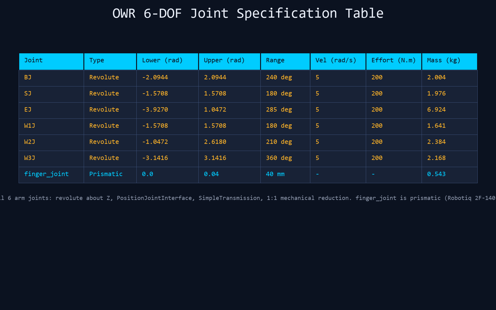
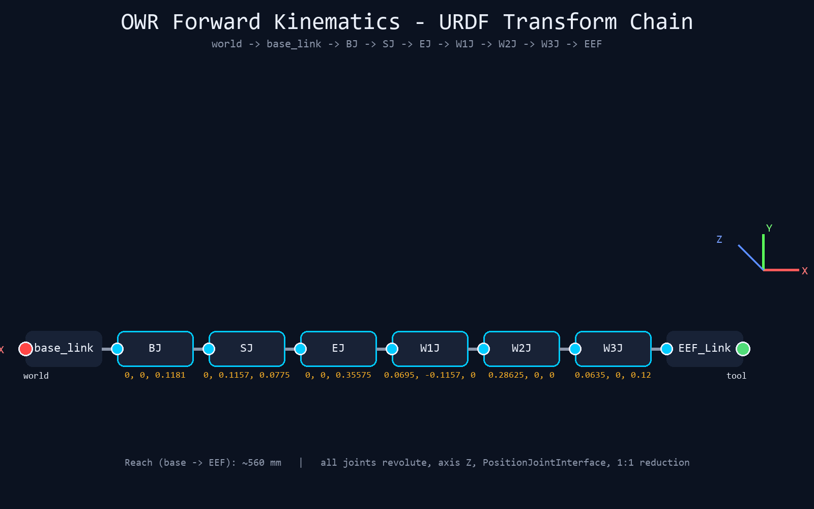
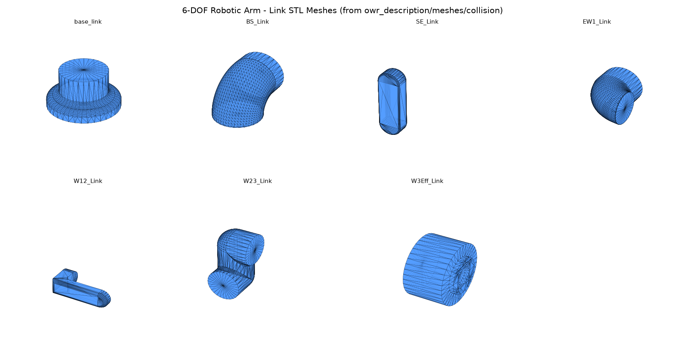
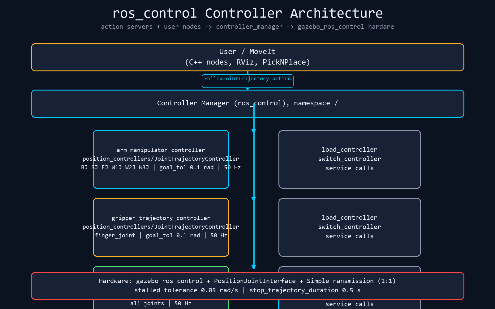
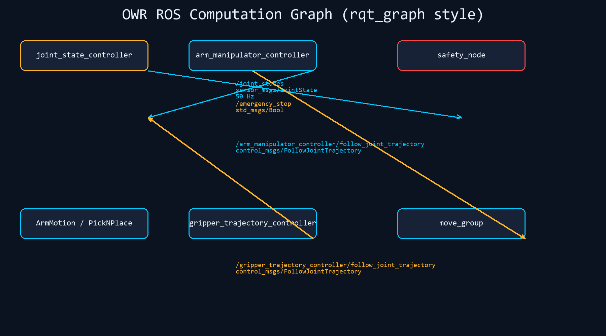
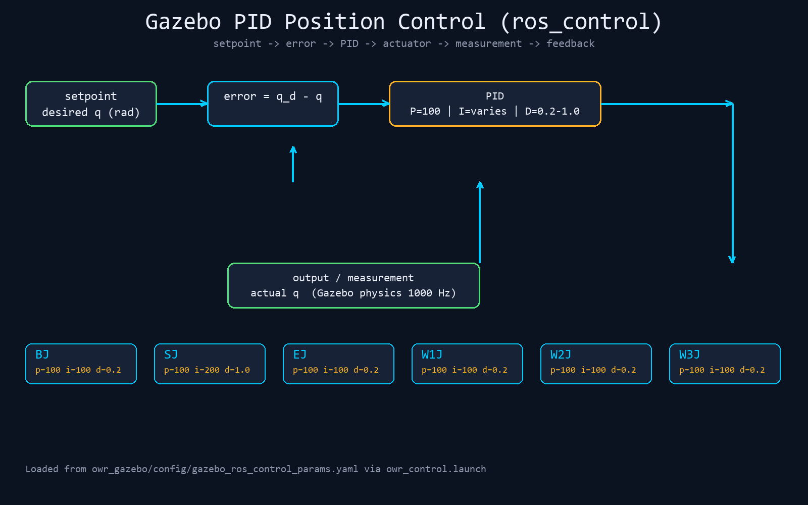
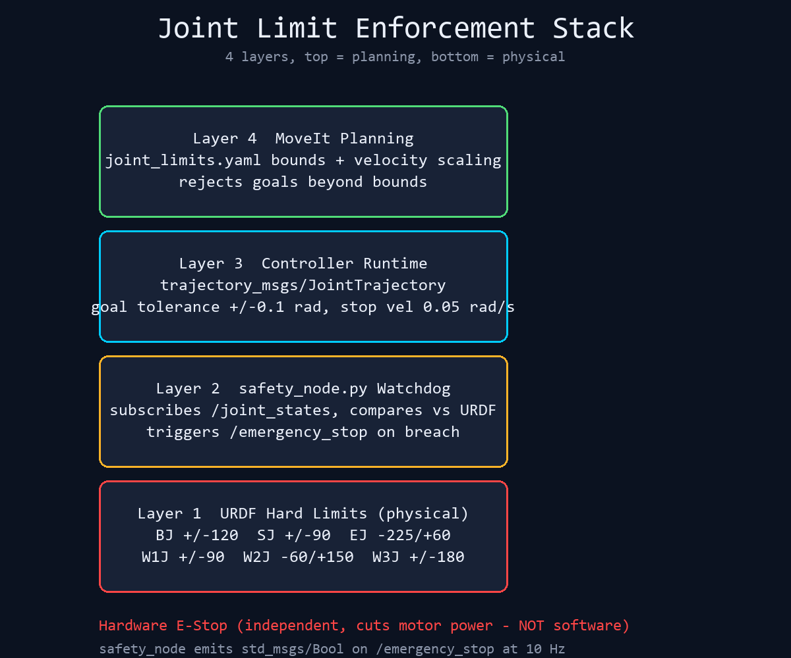
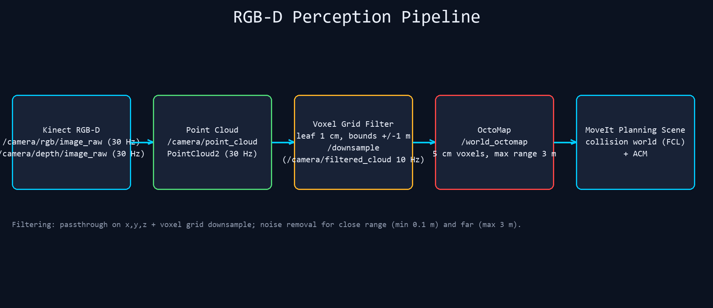
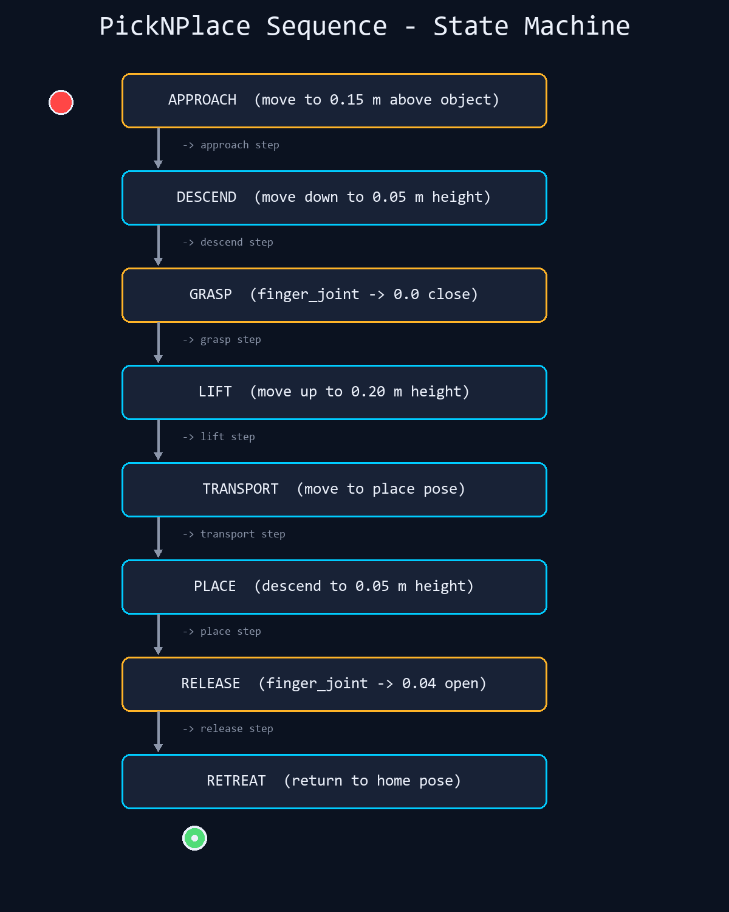

# 6-DOF Robotic Arm — ROS 1 Noetic (Industrial Baseline)


Hardened industrial reference for the OWR 6-DOF arm with Robotiq 2F-140 gripper: full Gazebo simulation, MoveIt motion planning (IKFast), and a safety layer with emergency-stop support.

- **Author:** [sam-black007](https://github.com/sam-black007)
- **Repository:** [sam-black007/6-dof-robotic-arm-ros1-industrial](https://github.com/sam-black007/6-dof-robotic-arm-ros1-industrial)
- **Status:** maintenance mode. ROS 1 Noetic is EOL; use for legacy systems only.


---

## 1. Robot

| | |
|---|---|
| Kinematics | 6 × revolute (Z-axis), URDF transform chain |
| Reach | ~560 mm base → end-effector |
| Gripper | Robotiq 2F-140, prismatic `finger_joint` (0–40 mm) |
| Real hardware | Arduino Mega 2560 + RAMPS 1.4, NEMA 17 (42BYGH47), 12 V 5 A supply |

**Joint specification** (URDF hard limits):

| Joint | Range (deg) | Vel (rad/s) | Effort (N·m) | Link mass (kg) |
|-------|-------------|-------------|--------------|----------------|
| `BJ`  | −120 … +120 | 5 | 200 | 2.004 |
| `SJ`  | −90 … +90   | 5 | 200 | 1.976 |
| `EJ`  | −225 … +60  | 5 | 200 | 6.924 |
| `W1J` | −90 … +90   | 5 | 200 | 1.641 |
| `W2J` | −60 … +150  | 5 | 200 | 2.384 |
| `W3J` | −180 … +180 | 5 | 200 | 2.168 |





---

## 2. Software Stack

| Layer | Technology |
|-------|------------|
| Middleware | ROS Noetic 1.16, `roscpp` / `rospy` |
| Simulation | Gazebo 11 (`PositionJointInterface`) |
| Motion planning | MoveIt 1.1, IKFast analytical solver |
| Trajectory control | `ros_control` joint trajectory controllers |
| Perception | RGB-D point cloud → OctoMap planning scene |

**Packages**

| Package | Contents |
|---------|----------|
| `owr_description` | URDF/Xacro, collision meshes (STL), transmissions, Gazebo plugins |
| `owr_gazebo` | World files, controllers, PID gains, robot spawn / control launch |
| `owr_moveit_config` | SRDF, IKFast config, joint limits, planning pipeline, controller interface |
| `owr_manipulation` | C++ nodes (`ArmMotion`, `PickNPlace`, …) + Python `safety_node` |
| `owr_gripper_ikfast_arm_manipulator_plugin` | IKFast solver plugin for MoveIt |

---

## 3. Control & ROS Interface

Controllers are managed by `ros_control` and defined in `owr_gazebo/config/controllers.yaml`.

| Controller | Type | Joints | Action server |
|------------|------|--------|---------------|
| `arm_manipulator_controller` | `JointTrajectoryController` | BJ … W3J | `/arm_manipulator_controller/follow_joint_trajectory` |
| `gripper_trajectory_controller` | `JointTrajectoryController` | `finger_joint` | `/gripper_trajectory_controller/follow_joint_trajectory` |
| `joint_state_controller` | `JointStateController` | all | publishes `/joint_states` @ 50 Hz |

PID gains per joint are loaded from `owr_gazebo/config/gazebo_ros_control_params.yaml`.

| Topic | Type | Direction |
|-------|------|-----------|
| `/joint_states` | `sensor_msgs/JointState` | 50 Hz |
| `/emergency_stop` | `std_msgs/Bool` | bidirectional |
| `/arm_manipulator_controller/state` | `control_msgs/JointTrajectoryControllerState` | 50 Hz |

Full interface reference (topics, services, actions, parameters, kinematics, launch args) → [docs/TECHNICAL_REFERENCE.md](docs/TECHNICAL_REFERENCE.md)





---

## 4. Safety

Emergency stop is **latched** and broadcast on `/emergency_stop` (`std_msgs/Bool`). `owr_manipulation/safety_node.py` monitors `/joint_states` against the URDF hard limits (with a 0.05 rad margin) and repeats the hardware E-stop signal.

| Layer | Enforcement |
|-------|-------------|
| Planning | MoveIt `joint_limits.yaml` bounds; goals beyond limits rejected |
| Runtime | Controller goal tolerance ±0.1 rad |
| Watchdog | `safety_node.py` — joint-limit check + E-stop latch @ 10 Hz |
| Physical | URDF hard limits; hardware E-stop must cut motor power independently |

> **Warning:** software-level emergency stop is NOT a substitute for a hardware E-stop circuit, which must disconnect motor power directly (e.g. RAMPS 1.4 power rail).



---

## 5. Perception

The arm builds its planning scene from an RGB-D camera: point cloud → voxel-grid filter → OctoMap → MoveIt collision world.

| Stage | Topic | Rate |
|-------|-------|------|
| Raw RGB / depth | `/camera/rgb/image_raw`, `/camera/depth/image_raw` | 30 Hz |
| Point cloud | `/camera/point_cloud` | 30 Hz |
| Filtered cloud | `/camera/filtered_cloud` (leaf 1 cm) | 10 Hz |
| OctoMap | `/world_octomap` (5 cm voxels) | 10 Hz |



---

## 6. Pick & Place

`PickNPlace` (C++) runs a full sequence through the MoveIt `move_group` interface: **approach → descend → grasp → lift → transport → place → release → retreat**.



---

## 7. Quick Start

```bash
# 1. Build (Ubuntu 20.04, ROS Noetic desktop-full)
mkdir -p ~/catkin_ws/src && cd ~/catkin_ws/src
git clone https://github.com/sam-black007/6-dof-robotic-arm-ros1-industrial.git
cd ~/catkin_ws && catkin_make && source devel/setup.bash

# 2. Gazebo + arm (Terminal 1)
roslaunch owr_gazebo robot_6dof_gazebo_spawn.launch gui:=true

# 3. MoveIt + RViz (Terminal 2)
roslaunch owr_moveit_config robot_6dof_moveit_sim.launch

# 4. Safety node (Terminal 3)
rosrun owr_manipulation safety_node.py

# 5. Smoke test motion (Terminal 4)
rosrun owr_manipulation ArmMotion
```

Verify:

```bash
rosnode list
rostopic echo /joint_states -n1
rosservice call /controller_manager/list_controllers
```


---

## 8. Continuous Integration

`.github/workflows/ros1-ci.yml` builds and launches every package on Ubuntu 20.04 + ROS Noetic on each push.


---

## 9. Documentation

| Document | Contents |
|----------|----------|
| [docs/TECHNICAL_REFERENCE.md](docs/TECHNICAL_REFERENCE.md) | Full engineering reference: kinematics, controllers, ROS interface, safety, perception, pick-and-place, build space |
| [docs/ROS1_INDUSTRIAL_CHECKLIST.md](docs/ROS1_INDUSTRIAL_CHECKLIST.md) | Industrial hardening checklist |

Additional diagrams: [workspace structure](images/workspace_structure.png) · [MoveIt planning pipeline](images/moveit_pipeline.png) · [ROS 1 vs ROS 2](images/ros1_vs_ros2.png) · [hardening summary](images/hardening_summary.png)

---

## 10. License & Maintenance

MIT — see [LICENSE](LICENSE). Maintained by sam-black007. Issues and pull requests welcome.

ROS 1 Noetic reached end of life; do not deploy for new production systems without a validated ROS 2 migration plan.