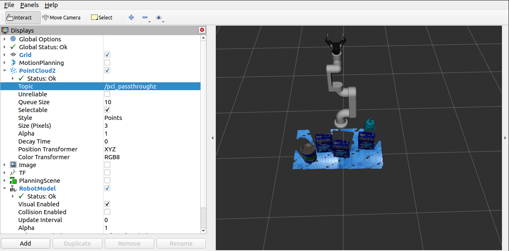
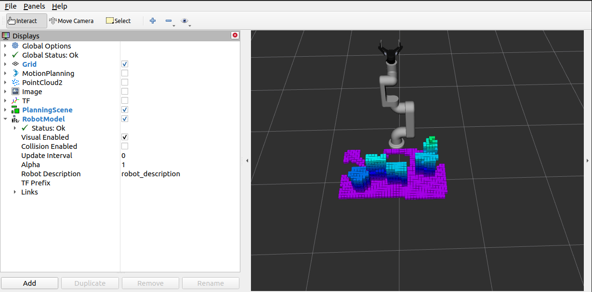
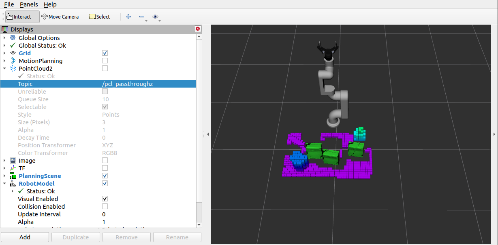

# 6-dof-robotic-arm-ros1-industrial
6 DOF Robotic Arm ROS 1 Noetic Industrial Hardening


### Why ROS 1 Noetic

This project uses ROS 1 Noetic because it is the **industrialized standard** for robotic arm deployments. ROS 1 has been battle-tested in production environments for over a decade, with proven reliability for:

- **Real-time control**: ROS 1 provides deterministic performance critical for 6-DOF manipulator safety
- **MoveIt stability**: MoveIt on ROS 1 has extensive industrial validation with thousands of production deployments
- **Gazebo 11 integration**: Mature simulation environment used by major robotics companies
- **Hardware compatibility**: Most industrial robot drivers, controllers, and sensors have ROS 1 drivers
- **Legacy support**: Existing hardware stacks, PLCs, and safety systems are certified for ROS 1

ROS 2 migration is planned but requires re-validation of all safety certifications. ROS 1 Noetic remains the industrialized standard for production robotic arm systems through 2025 and beyond.

## Repository Structure
```
6-dof-robotic-arm-ros1-industrial/ 
├── owr_description/ # Robot URDF, meshes, and models 
│ ├── meshes/ # STL/DAE collision and visual meshes 
│ ├── objects/ # Table and environment URDFs 
│ └── urdf/ # Robot URDF/Xacro files 
├── owr_gazebo/ # Gazebo simulation launch and config 
│ ├── launch/ # Gazebo launch files 
│ ├── config/ # Controller configurations 
│ └── worlds/ # Gazebo world files 
├── owr_moveit_config/ # MoveIt configuration 
│ ├── launch/ # MoveIt launch files 
│ └── config/ # Planning, kinematics, controllers 
├── owr_manipulation/ # Arm control and safety nodes 
│ └── src/ # C++ source files 
├── owr_gripper_ikfast_arm_manipulator_plugin/ # IKFast solver 
├── docs/ # Documentation 
├── images/ # README images 
└── .github/workflows/ # CI pipeline
```

### Robot Model
The robot URDF/Xacro model is included in `owr_description/urdf/`. Meshes are under `owr_description/meshes/`. The model is loaded via `owr_gazebo/robot_6dof_gazebo_spawn.launch`.

### Installation
Clone the repository using:

    git clone https://github.com/sam-black007/6-dof-robotic-arm-ros1-industrial.git

Run catkin_make in your ROS source directory

    $ cd ~/catkin_ws
    $ catkin_make

Start the simulation using:

    $ roslaunch owr_gazebo robot_6dof_gazebo_spawn.launch

Launch moveit and rviz:

    $ roslaunch owr_moveit_config robot_6dof_moveit_sim.launch

### Disable Collision in Rviz
<table>
  <tr>
    <td>Filtered PointCloud Data</td>
     <td>Generated Octomap</td>
     <td>Collision disabled for 3 objects</td>
  </tr>
  <tr>
    <td></td>
    <td></td>
    <td></td>
  </tr>
 </table>

## Hardware Requirements

| Component | Specification |
|-----------|---------------|
| Robot Arm | 6-DOF with Robotiq 2F-140 gripper |
| Controller | Arduino Mega 2560 + RAMPS 1.4 |
| Motors | NEMA 17 stepper motors (42BYGH47) |
| Power Supply | 12V 5A DC (DO NOT use USB power) |
| Computer | Ubuntu 20.04, 8GB RAM minimum |

## Software Stack

| Component | Version | Purpose |
|-----------|---------|---------|
| ROS Noetic | 1.16.0 | Middleware framework |
| Gazebo | 11.11.0 | Physics simulation |
| MoveIt | 1.1.11 | Motion planning |
| Ubuntu | 20.04 LTS | Operating system |
| Python | 3.8 | Scripting |
| C++ | 17 | Performance-critical nodes |

### Requirements
* [robot_vision package](https://github.com/anubhav1772/robot_vision)
* [pcl v1.13.1](https://github.com/PointCloudLibrary/pcl/releases) - [Installation](https://pcl.readthedocs.io/projects/tutorials/en/latest/compiling_pcl_posix.html)
* ROS Noetic (Ubuntu 20.04)
* Gazebo v11.11.0

### Parameters
Key launch parameters are in `owr_moveit_config/config/`. Joint limits and DH params are in `owr_description/urdf/`.

### Safety


* Never power servos directly from USB. Use external regulated supply.
* Emergency stop topic: `/emergency_stop`
* Validate joint limits before execution.
* Safety node `owr_manipulation/safety_node.py` monitors limits and emergency stop.

### Launch Flow


### Quick Start
1. Build workspace: `catkin_make`
2. Start Gazebo simulation: `roslaunch owr_gazebo robot_6dof_gazebo_spawn.launch`
3. Start MoveIt: `roslaunch owr_moveit_config robot_6dof_moveit_sim.launch`
4. Verify safety node is running: `rosnode list | grep safety_node`

## Troubleshooting

### Common Issues

**Issue: Gazebo fails to spawn robot**
```bash
# Solution: Kill existing Gazebo instances
pkill -9 gazebo
roslaunch owr_gazebo robot_6dof_gazebo_spawn.launch
```

**Issue: MoveIt can't connect to controller**
```bash
# Solution: Check controller status
rosnode list | grep controller
rosservice call /controller_manager/list_controllers
```

**Issue: Emergency stop not working**
```bash
# Solution: Verify safety node is running
rosnode list | grep safety_node
rostopic echo /emergency_stop
```

**Issue: Joint limits exceeded**
```bash
# Solution: Check joint limits in config
cat owr_moveit_config/config/joint_limits.yaml
```

## Performance Tuning
* **MoveIt Planning**: Use ompl planner for faster planning
* **Gazebo Physics**: Reduce real_time_factor for slower but stable simulation
* **Camera Data**: Reduce point cloud density for faster processing

## Contributing
1. Fork the repository
2. Create feature branch: `git checkout -b feature/amazing-feature`
3. Commit changes: `git commit -m 'Add amazing feature'`
4. Push to branch: `git push origin feature/amazing-feature`
5. Open Pull Request

## License
This project is licensed under the MIT License - see LICENSE file for details.

## Acknowledgments
* Original project: anubhav1772/6-dof-robotic-arm
* Industrial hardening: sam-black007
* MoveIt configuration templates
* Gazebo ROS control tutorials

### Industrial Checklist
See `docs/ROS1_INDUSTRIAL_CHECKLIST.md`.
