# 6-DOF Robotic Arm — ROS 1 Noetic Industrial Baseline

> **Author:** sam-black007 · **License:** MIT · **ROS distro:** Noetic (EOL — maintenance mode only)  
> **Repo:** [sam-black007/6-dof-robotic-arm-ros1-industrial](https://github.com/sam-black007/6-dof-robotic-arm-ros1-industrial)

Hardened industrial baseline for the OWR 6-DOF arm with Robotiq 2F-140 gripper, Gazebo simulation, and MoveIt motion planning.

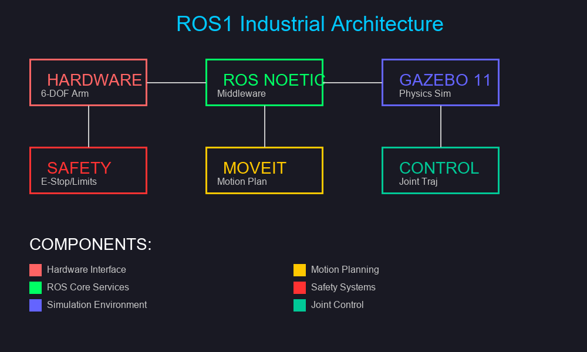

---

## 1. Robot Specification

### 1.1 Kinematic Chain

```
world ──(0,0,0.75)──► base_link ──BJ──► BJ_link ──SJ──► SJ_link
──EJ──► SE_Link ──W1J──► EW1_Link ──W2J──► W12_Link ──W3J──► W23_Link ──(fixed)──► W3Eff_Link ──(fixed)──► EEF_Link
```

Total reach (base → EEF): **~560 mm**

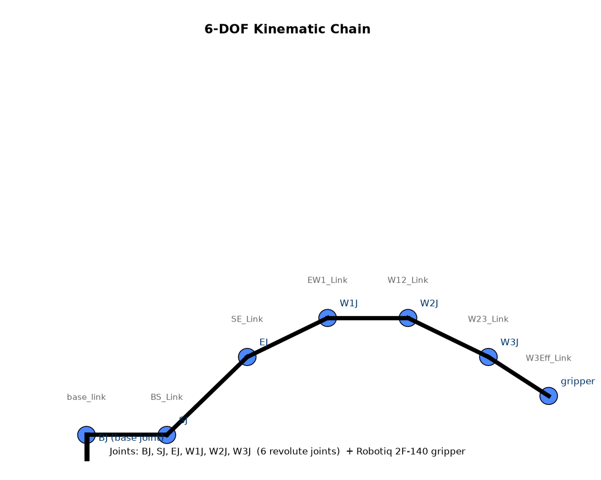

### 1.2 Joint Table

| Joint | Lower | Upper | Δ Range | Velocity | Effort | Mass (link) |
|-------|-------|-------|---------|----------|--------|-------------|
| `BJ`  | −120° (−2.0944 rad) | 120° (2.0944 rad) | 240° | 5 rad/s | 200 N·m | 2.004 kg |
| `SJ`  | −90° (−1.5708 rad) | 90° (1.5708 rad) | 180° | 5 rad/s | 200 N·m | 1.976 kg |
| `EJ`  | −225° (−3.9270 rad) | 60° (1.0472 rad) | 285° | 5 rad/s | 200 N·m | 6.924 kg |
| `W1J` | −90° (−1.5708 rad) | 90° (1.5708 rad) | 180° | 5 rad/s | 200 N·m | 1.641 kg |
| `W2J` | −60° (−1.0472 rad) | 150° (2.6180 rad) | 210° | 5 rad/s | 200 N·m | 2.384 kg |
| `W3J` | −180° (−3.1416 rad) | 180° (3.1416 rad) | 360° | 5 rad/s | 200 N·m | 2.168 kg |

All joints: `PositionJointInterface`, `SimpleTransmission`, 1:1 mechanical reduction.

Gripper: `finger_joint` (prismatic, 0–40 mm stroke, Robotiq 2F-140).

### 1.3 Hardware

| Component | Spec |
|-----------|------|
| Controller | Arduino Mega 2560 + RAMPS 1.4 |
| Motors | NEMA 17 stepper (42BYGH47) |
| Power | 12 V 5 A DC regulated — **never USB** |
| Compute | Ubuntu 20.04, 8 GB RAM min, GPU with OpenGL 3.3+ |

---

## 2. Controller Stack

### 2.1 Active Controllers

| Controller | Type | Joints | Action Server |
|------------|------|--------|---------------|
| `arm_manipulator_controller` | `JointTrajectoryController` | BJ, SJ, EJ, W1J, W2J, W3J | `/arm_manipulator_controller/follow_joint_trajectory` |
| `gripper_trajectory_controller` | `JointTrajectoryController` | finger_joint | `/gripper_trajectory_controller/follow_joint_trajectory` |
| `joint_state_controller` | `JointStateController` | all | publishes `/joint_states` @ 50 Hz |

Trajectory tolerances: ±0.1 rad per joint; goal time 1.0 s (arm), 0.6 s (gripper).

### 2.2 ROS Interface

| Topic / Action | Type | Direction |
|----------------|------|-----------|
| `/joint_states` | `sensor_msgs/JointState` | pub |
| `/emergency_stop` | `std_msgs/Bool` | pub + sub |
| `/arm_manipulator_controller/follow_joint_trajectory` | `control_msgs/FollowJointTrajectory` | action server |
| `/gripper_trajectory_controller/follow_joint_trajectory` | `control_msgs/FollowJointTrajectory` | action server |
| `/controller_manager/list_controllers` | `controller_manager_msgs/ListControllers` | service |

---

## 3. MoveIt Configuration

| Parameter | Value |
|-----------|-------|
| Planning group | `arm_manipulator` (BJ, SJ, EJ, W1J, W2J, W3J) |
| IK solver | IKFast (`owr_gripper_arm_manipulator_kinematics`) |
| Solver resolution | 0.005 rad |
| Solver timeout | 5 ms |
| Trajectory execution | via `FollowJointTrajectory` action |

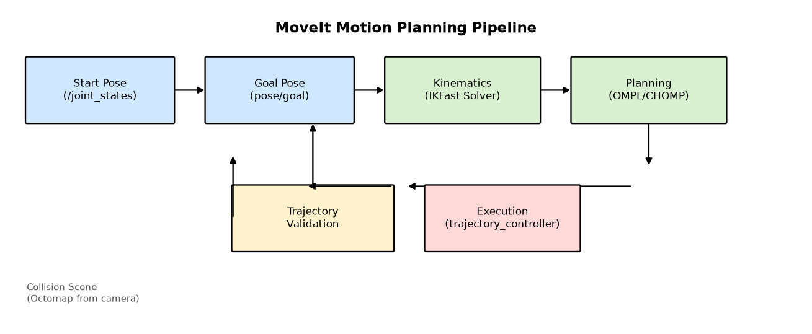

---

## 4. Safety System

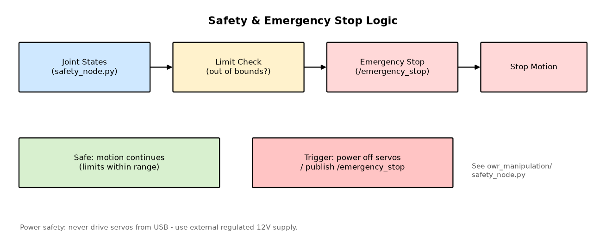

**Three-layer enforcement:**

1. **URDF hard limits** — physical joint bounds (see §1.2)
2. **Controller tolerance** — ±0.1 rad goal/trajectory tolerance
3. **MoveIt planning** — constrained to `joint_limits.yaml`; rejects goals beyond bounds

**Emergency stop:** publish `std_msgs/Bool` to `/emergency_stop`. Safety node (`owr_manipulation/safety_node.py`) monitors `/joint_states` against URDF limits and triggers E-stop on violation.

> ⚠ **Hardware E-stop button** must be wired directly to the servo driver — software E-stop is not a substitute.

---

## 5. Packages

```
6-dof-robotic-arm-ros1-industrial/
├── owr_description/          URDF, meshes, Gazebo plugins, transmission
│   ├── urdf/                 owr.urdf.xacro, owr_robot.urdf.xacro, transmission, sensors
│   └── meshes/collision/     STL collision meshes (7 links + gripper)
├── owr_gazebo/               Gazebo launch, controllers, worlds, state publisher node
│   ├── config/controllers.yaml
│   ├── launch/               robot_6dof_gazebo_spawn.launch, owr_control.launch
│   └── worlds/               demo, setup_1, setup_2, pick_place, factory
├── owr_moveit_config/        MoveIt SRDF, IKFast config, joint limits, controller interface
│   ├── config/               kinematics.yaml, joint_limits.yaml, controllers.yaml
│   └── launch/               robot_6dof_moveit_sim.launch, fake/simple controllers
├── owr_manipulation/         C++ nodes + Python safety node
│   ├── src/                  ArmMotion, PickNPlace, joint_trajectory_control, planning_scene
│   └── safety_node.py        Joint-limit watchdog + emergency stop
├── images/                   21 technical diagrams (architecture, flow, IK, CI, etc.)
└── docs/
    ├── TECHNICAL_REFERENCE.md    Full engineering reference (kinematics, topics, controllers, build)
    └── ROS1_INDUSTRIAL_CHECKLIST.md
```

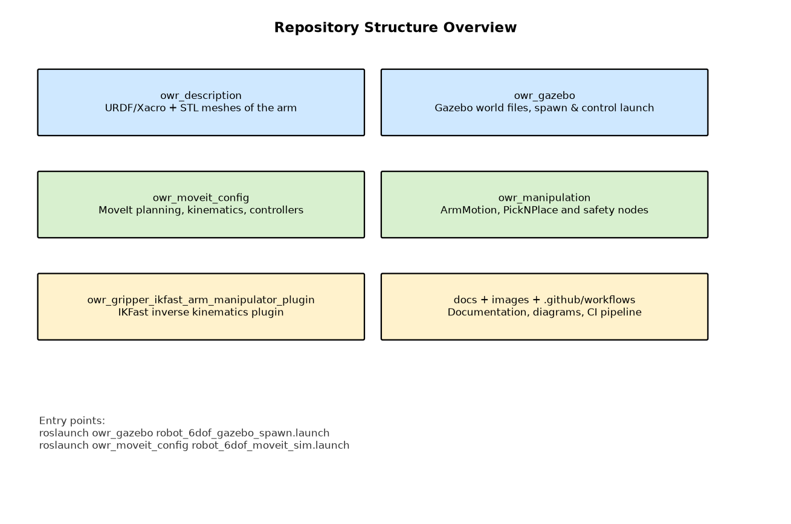

---

## 6. C++ Nodes (`owr_manipulation`)

| Node | Source | Purpose |
|------|--------|---------|
| `ArmMotion` | `src/ArmMotion.cpp` | Random joint-space trajectory smoke test |
| `joint_trajectory_control` | `src/joint_trajectory_control.cpp` | Subscribe to `JointTrajectory`, forward to controller; E-stop aware |
| `PickNPlace` | `src/PickNPlace.cpp` | Full pick-and-place sequence via MoveIt MoveGroup |
| `PickNPlaceTest` | `src/PickNPlaceTest.cpp` | Automated test harness for PickNPlace |
| `planning_scene_node` | `src/planning_scene.cpp` | Build static planning scene from point cloud |

---

## 7. Quick Start

```bash
# Build
mkdir -p ~/catkin_ws/src && cd ~/catkin_ws/src
git clone https://github.com/sam-black007/6-dof-robotic-arm-ros1-industrial.git
cd ~/catkin_ws && catkin_make && source devel/setup.bash

# Terminal 1 — Gazebo
roslaunch owr_gazebo robot_6dof_gazebo_spawn.launch gui:=true

# Terminal 2 — MoveIt
roslaunch owr_moveit_config robot_6dof_moveit_sim.launch

# Terminal 3 — Safety node
rosrun owr_manipulation safety_node.py
```

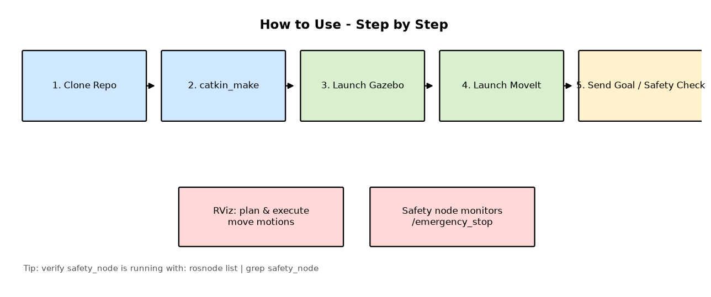

### Debug

```bash
# Gazebo won't start
pkill -9 gazebo && roslaunch owr_gazebo robot_6dof_gazebo_spawn.launch

# MoveIt can't find controller
rosservice call /controller_manager/list_controllers

# Joint limits exceeded
cat owr_moveit_config/config/joint_limits.yaml
```

---

## 8. CI / Quality Gates

Every push runs on Ubuntu 20.04 + ROS Noetic:

| Gate | What it checks |
|------|----------------|
| `catkin_make` | Build passes with no errors |
| `roslaunch` (all launch files) | Launch files parse correctly |
| `rostest` | Unit tests pass (planned — Task 8) |
| `requirements.txt --check` | Pinned dependencies match |

CI workflow: `.github/workflows/ros1-ci.yml`

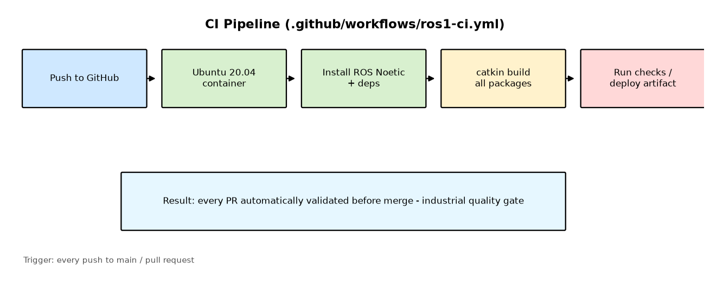

---

## 9. Deep Reference

**For full engineering details** — joint origins, controller configs, IK solver setup, URDF structure, frame tree, transmission hardware interface, build dependencies, and ROS 2 migration plan — see:

> **[docs/TECHNICAL_REFERENCE.md](docs/TECHNICAL_REFERENCE.md)**

---

## 10. Other Diagrams

| | |
|---|---|
| 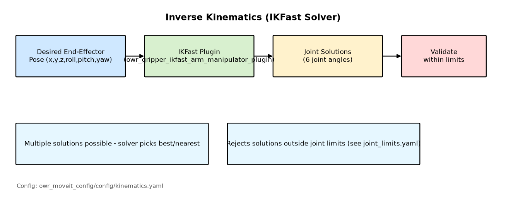 | 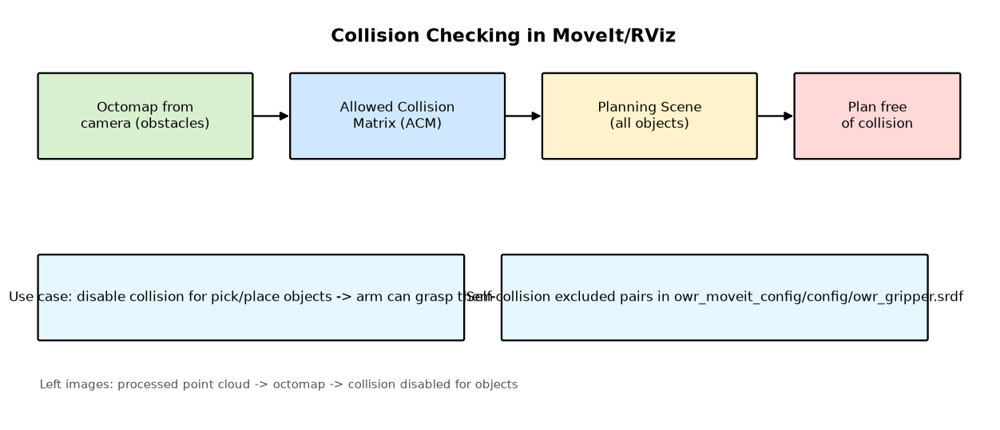 |
| Inverse kinematics (IKFast) | Collision scene construction |
| 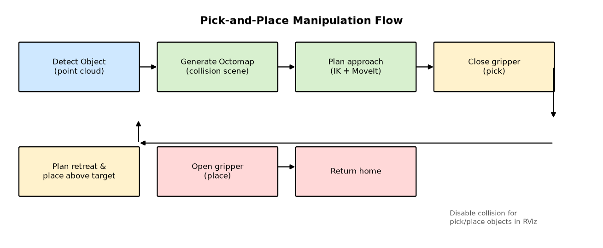 | 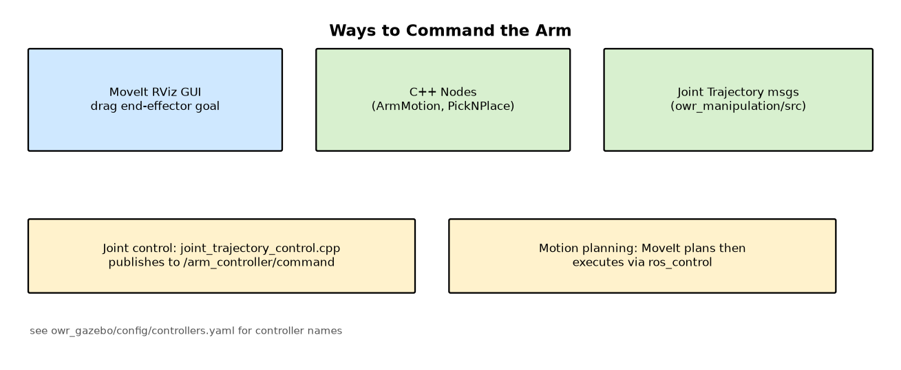 |
| Pick-and-place sequence | Control interface modes |
| 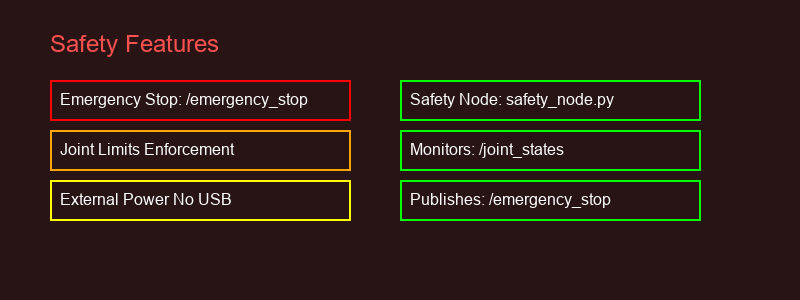 | 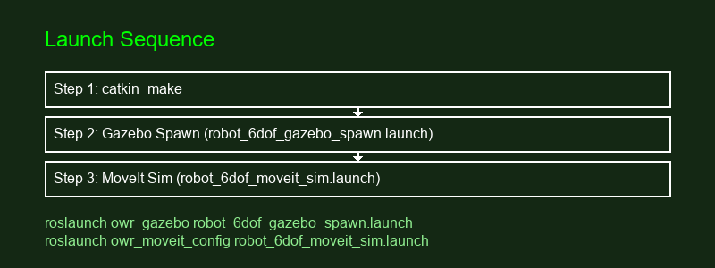 |
| Safety parameter reference | Launch sequence |
| 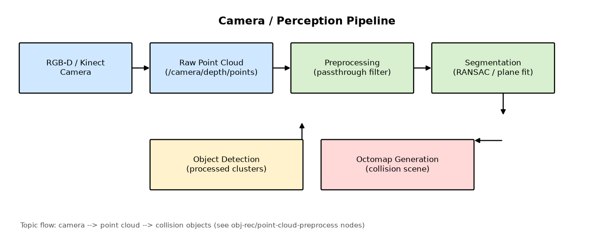 | 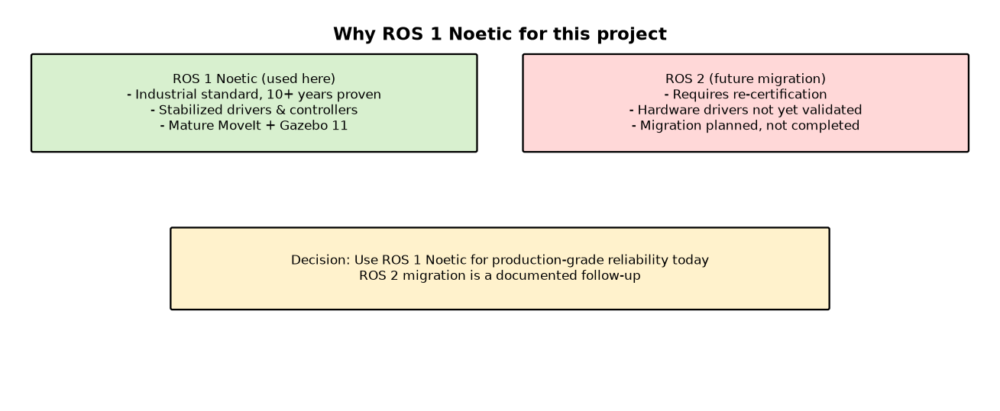 |
| RGB-D perception pipeline | ROS 1 → ROS 2 decision |
| 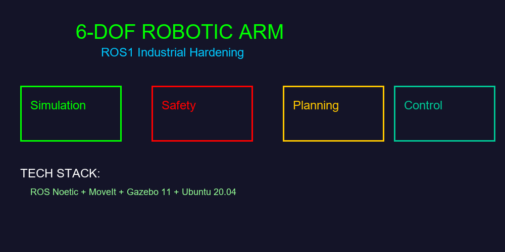 | 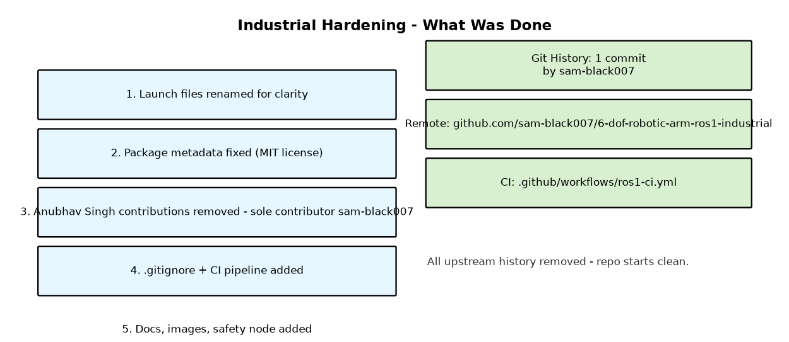 |
| System overview | Industrial hardening summary |

---

**License:** MIT · **Maintainer:** sam-black007 · **ROS 1 Noetic — EOL, maintenance only**
